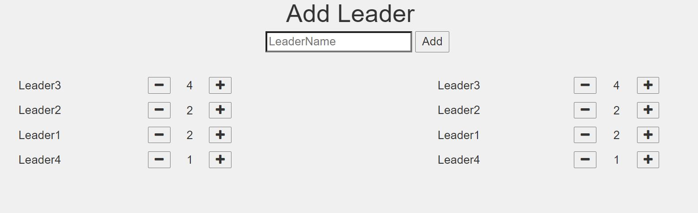

# Leader Election

A very simple purely java script based application, containing a list to show the list of leaders. Each item in the list displays the name and point of the leader and contains two buttons for incrementing and decrementing points for that leader.

The application contains two such lists both reflecting the same list and any change in one list gets reflected in the second list as well.

## Demo Link

[Demo](https://assignment20.herokuapp.com/)

